# Hello World, I'm Gustavo Barros!

### 🧠 AI Engineer | 🛠️ NLP and Data Science Researcher | 🏋️ Co-founder @ NeuroFit

Sou graduando em **Inteligência Artificial pela UFG** e movido pelo desafio de transformar modelos complexos em soluções que impactam o mundo real.

---

  

  
   
  
   
  

---

##  No que estou trabalhando agora?
  
* **CEIA (Centro de Excelência em IA):** Pesquisador no *Projeto Ultimatum*. Foco em **Infraestrutura de MLOps e CI/CD** para agentes de IA jurídica. 
* **Grupo Bancorbrás:** Arquiteto de Agentes de IA, explorando o ecossistema **LangChain** e ferramentas Low-code para automação inteligente. 
* **[NeuroFit](https://neurofit-ia.com):** Co-fundador. Utilizamos **Agentes de IA e Churn Prediction** para revolucionar a experiência em academias.

   
  

---

##  Tech Stack & Toolbox

###  Intelligence & Data

  
  
  
  
  
  
  
  

###  DevOps & MLOps

  
  
  

---

## 🌟 Studies

  

---

## 📊 Focus Sectors

  

---

## ⚙️ GitHub Analytics

  

---

## 🤝 Vamos construir algo juntos?

  
  
  

 

> "Apaixonado por resolver problemas reais onde a tecnologia é o meio, não apenas o fim."
