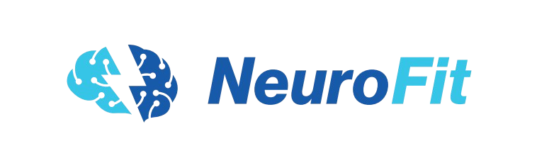

# Hello World, I'm Gustavo Barros! 

### 🧠 AI Engineer | 🛠️ NLP and Data Science Researcher | 🏋️ Co-founder @ NeuroFit

Sou graduando em **Inteligência Artificial pela UFG** e movido pelo desafio de transformar modelos complexos em soluções que impactam o mundo real.
  
## ⚙️ &nbsp;GitHub Analytics

  

---

##  No que estou trabalhando agora?
  
* **CEIA (Centro de Excelência em IA):** Pesquisador no *Projeto Ultimatum*. Foco total em **Infraestrutura de MLOps e CI/CD** para agentes de IA jurídica. 
* **Grupo Bancorbrás:** Arquiteto de Agentes de IA, explorando o ecossistema **LangChain** e ferramentas Low-code para automação inteligente. 
* **[NeuroFit](https://neurofit-ia.com):** Co-fundador. Utilizamos **Agentes de IA e ML Clássico** para revolucionar a experiência em academias.  

   
  
---

##  Tech Stack & Toolbox

###  Intelligence & Data

  
  
  
  
  
  

###  DevOps & MLOps

  
  
  

###  Metodologias & Negócios
`Lean Manufacturing` • `Kaizen` • `MDPE (Micro-task Driven Prompt Engineering)`

---

##  Vamos conectar?

  
  &nbsp;&nbsp;&nbsp;
  

> "Apaixonado por resolver problemas reais onde a tecnologia é o meio, não apenas o fim." 
